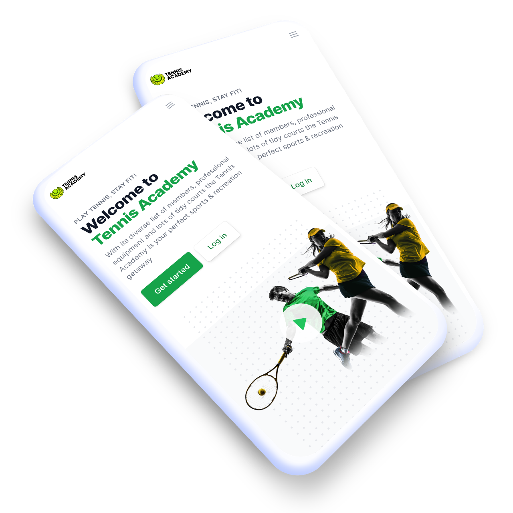

# Tennis Academy

This is a project for the PPE "Projet Personnel Encadré" at the University of SESAME. 

The application allows the tennis academy to manage its members, courts, and bookings. The application is built using the Laravel framework (Back-end) and Angular 13 (Front-end)

## Installation
### Back-end
1. Clone the repository
2. Install the dependencies using `composer install`
3. Create a `.env` file and copy the content of `.env.example` into it
4. Generate an application key using `php artisan key:generate`
5. Create a database and add the credentials to the `.env` file
6. Run the migrations and the seeders using `php artisan migrate:fresh --seed`
7. Start the server using `php artisan serve`

### Front-end
1. Install the dependencies using `npm install`
2. Start the server using `ng serve`    

## Usage
### Back-end
The back-end is accessible at `http://localhost:8000/api/`

### Front-end
The front-end is accessible at `http://localhost:4200/` 